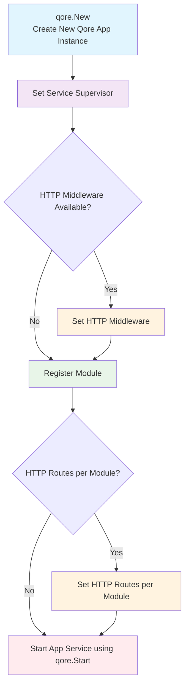

# Qore : Go toolkit

Qore is small Go toolkit-like framework build on top [Echo web framework](https://github.com/labstack/echo) as a HTTP framework.

Qore adopts a clean architecture pattern, and all business logic is modular.

## Table of Contents

- [Qore CLI](#qore-cli)
    - [Capabilities](#capabilities)
    - [Installing the CLI](#installing-the-cli)
    - [Commands](#commands)
- [Qore Package](#qore-package)
    - [Application Lifecycle](#application-lifecycle)
    - [Installing the package](#installing-the-package)
    - [Using package](#using-package)

## Qore CLI

### Capabilities

Currently, the Qore CLI is limited and still under active development. Its current capabilities include:
- [ ] Create project.
- [x] Add new module into the project.
- [x] Remove an module from the project.
- [ ] Create new dependency.

### Installing the CLI

Install Qore CLI by running:

```shell
go install github.com/qoinlyid/qore/cmd/qore@latest
```

and ensuring that `$GOPATH/bin` is added to your `$PATH`.

### Commands

- Add new module into the project
```bash
qore mod new
```

- Remove existing module from the project
```bash
qore mod remove
```

## Qore Package

### Application Lifecycle

The application lifecycle of Qore app



### Installing the package

```bash
go get github.com/qoinlyid/qore@latest
```

### Using package

Simple use.

```go
func main() {
    // Create new application.
	app := qore.New()

    // Load module (business-logic).
    app.LoadModule(moduleLoader)

    // Start service.
	app.Start(supervisor)
}
```

If you are want to use HTTP service, you can set middleware by:

```go
app.SetHttpMiddleware(middlewares ...qore.HttpMiddleware)
```

Registering an HTTP route within a module is simple and can be done in the *http_routes.go* file as follows:

```go
// HttpRoutes will set module's HTTP(s) route into the `qore#App`
func (m *Module) HttpRoutes(app *qore.App) {
    app.SetHttpRoutes(func(router *qore.HttpRouter) {
		router.Get("user", qore.HttpHanlderChain(m.HandlerUserGet))
	})
}
```